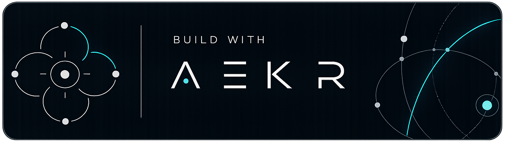
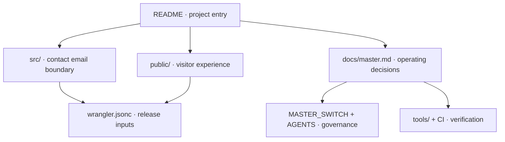

# aekr-web — conceptual Project Map

Open the [interactive Project Map](PROJECT_MAP.html) directly from disk. It is
self-contained and needs no server or external JSON load. The optional
[machine-readable structure](project-map.json) owns stable IDs, paths and hierarchy.

The public site combines content, responsive styles and decorative browser
interaction. The Worker owns contact validation and email delivery. Hosting
configuration connects the two and limits static publication to `public/`.

Repository documentation, the map, governance files and validators form the
engineering workspace outside the public release directory. The root banner is
local workflow attribution; it is not certification or a remote dependency.

`MASTER_SWITCH.md` is the sole source of current capability states.
`docs/master.md` owns project scope, decisions and verification boundaries.
`wrangler.jsonc` owns declared deployment inputs; actual Cloudflare deployments
require external evidence. The map grants no approval, runtime capability or
deployment authority and intentionally contains no volatile switch values,
provider selections, phase claims or test counts.

Implementation details, credentials, external account state, generated files and
private upstream orchestration artifacts are intentionally outside map coverage.
