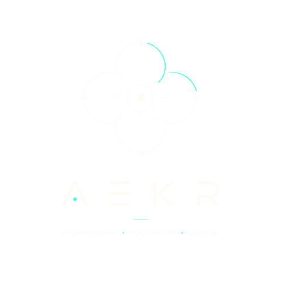

<p align="center">
  
</p>

# aekr-web

The public website for **aekr.io** — AEKR is an AI-native, human-orchestrated
software engineering practice.

- **Status:** public website; verify the exact deployment before reporting an increment live
- **Route:** local editing and checks; Cloudflare hosting (no website build step)
- **Governance:** Lean / Mode 0 — public information and a bounded email endpoint

Open the [interactive Project Map](PROJECT_MAP.html) directly from disk for
repository orientation. [Conceptual map](PROJECT_MAP.md) ·
[Machine-readable structure](project-map.json).

[Project decisions and operating guide](docs/master.md) records scope, authority,
upstream provenance, the explicit Racking branding variance and verification
boundaries. Read [MASTER_SWITCH.md](MASTER_SWITCH.md) and [AGENTS.md](AGENTS.md)
before substantive repository work.

## Stack

Static HTML + CSS with one dependency-free script for the interactive
background and the contact form. No framework, no bundler, no npm
dependencies at runtime. A small Worker sits in front of the static assets to
handle contact-form delivery.

```
aekr-web/
├── public/                  ← served as static assets
│   ├── index.html
│   ├── styles.css
│   ├── script.js
│   ├── 404.html
│   ├── favicon.ico
│   ├── robots.txt
│   ├── _headers
│   └── assets/
│       ├── aekr-mark.png     ← orbital mark only (hero)
│       ├── aekr-logo.png     ← full lockup
│       ├── aekr-banner.png
│       └── AEKR-BANNER-LICENSE.txt
├── src/
│   └── index.js              ← Worker: POST /api/contact, else static assets
├── assets/                  ← canonical README/map banner and license (not served)
├── docs/master.md           ← concise source of truth and operating guide
├── PROJECT_MAP.html         ← standalone interactive repository map
├── PROJECT_MAP.md
├── project-map.json         ← canonical map structure
├── MASTER_SWITCH.md
├── AGENTS.md
├── OWNER_PROFILE.md
├── aekr-scaffold.json
├── tools/                   ← local integrity validators and provenance
├── .github/workflows/       ← validation-only CI
├── package.json             ← dependency-free local check command
├── wrangler.jsonc
├── LICENSE
└── README.md
```

### Brand assets

The three website PNGs in `public/assets/` carry real alpha. They were flattened against a near-black
field originally, which showed as a visible rectangle on the page background;
the field is now keyed out so they composite cleanly over any dark surface.
If you replace them, keep the transparency — do not re-export onto a solid
background.

Primary AEKR headings reuse the lettering from the official logo through the
`.brand-lettering` CSS crop. Preserve the artwork's A/E/K/R shapes and mint dot;
do not substitute a similar font. Accessible AEKR text remains in the markup.

### Nebula source attribution

The nebula rendering in `public/script.js` was adapted from Ed's accreatio source
under his explicit authorization for this website. That portion retains its
source copyright and reserved rights; the repository's general MIT license does
not silently relicense accreatio or grant broader reuse rights to its source.
The current reference is the deployed design-v14 preview at
`53343211a2176be487c17fa8f58202146f3eac7e`: autonomous currents and left-click gas
bursts, with the AEKR palette. See [the follow-up verification record](docs/nebula-follow-up-2026-09-04.md).

## Contact form

`POST /api/contact` accepts `{ email, comment, company, requestType }` and
emails the submission. `requestType` is either `contact` or `pricing`, which
only changes the subject line so the two are distinguishable in the inbox.
`company` is a honeypot — real visitors never see it.

The destination mailbox is **never** in the repo or the client bundle. It is
a Worker secret:

```
npx wrangler secret put CONTACT_RECIPIENT_EMAIL
```

The sender address (`CONTACT_SENDER_EMAIL`, default `website@aekr.io`) is a
plain var in `wrangler.jsonc`; its domain must be onboarded to Cloudflare
Email Sending:

```
npx wrangler email sending enable aekr.io
npx wrangler email sending dns get aekr.io
```

If either the secret or the `EMAIL` binding is missing, the endpoint returns
`503` and the form shows a failure. It never reports success for a message it
did not send.

## Validation

Use Node 22 or newer. No dependency installation or credentials are needed:

```sh
npm run check
```

The checks validate syntax, local references, deployment boundaries, the Project
Map and the declared AEKR scaffold variant. CI repeats the same command on pushes
and pull requests. It does not deploy the site or prove live email delivery.
Visual and keyboard checks remain part of review for frontend/map changes.

The section-navigation browser checks run with `npm run check:browser` using an
existing Playwright installation. If that installation is outside the project,
set `PLAYWRIGHT_MODULE` to its module entry and optionally `BROWSER_EXECUTABLE`
to a Chromium-compatible browser executable. No website dependency is added.
The check starts a temporary local static server, exercises desktop/mobile
navigation, history, keyboard, touch, form preservation and motion preferences,
and intercepts contact submissions so it cannot send email. `SITE_URL` selects
an already running site; `SCREENSHOT_DIR` optionally saves viewport screenshots.
`BASELINE_REF` additionally compares all original section markup against a Git
revision during local verification. Browser checks are separate from the
dependency-free default CI command.

## Local preview

```
npx wrangler dev
```

Serves the static assets and the Worker together. Email sends are not
delivered locally unless the `send_email` binding is marked `"remote": true`.

## Deployment and rollback

[Verified pre-refresh backup and rollback instructions](docs/rollback.md).

Cloudflare Workers with static assets serves `aekr.io`. Only `public/` is the
static asset directory; repository documentation and tools are not published.
The existing Cloudflare Workers Builds integration can deploy the configured
branch after a push. The validation workflow is separate: verify both results
for the exact commit and do not assume deployment waits for validation.

Before authorized delivery, run the checks, review the diff, and record the
currently deployed version. Observe the new Cloudflare build/version and smoke
check the homepage, asset responses, 404 page and contact error handling. A
successful local check or push is not a production result.

For a separately authorized manual deployment with the existing account session:

```sh
npx wrangler deploy
```

If the new version fails verification, restore the previously recorded Worker
version through Cloudflare's deployment controls, then repeat the smoke checks.
For source recovery, revert the bounded change through normal Git history;
avoid rewriting the shared branch. Never infer inbox delivery from HTTP success
without checking a separately authorized test message.

---

Built with the **AI Engineering Knowledge Racking (AEKR)** workflow.


