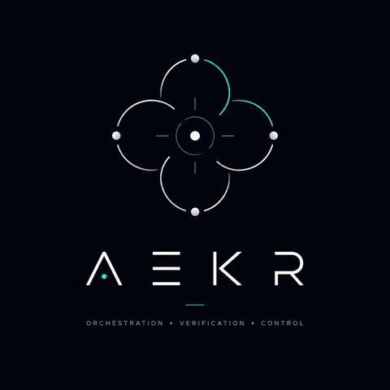

<p align="center">
  
</p>

# aekr-web

The public website for **aekr.com** — a single static page explaining what
AEKR (AI Engineering Knowledge Repo) is, in about 10–15 seconds.

- **Status:** first implementation, pre-deploy
- **Route:** A — local-first (no backend, no build step)
- **Governance:** Lean — public, static, low-risk

## Stack

Plain HTML + CSS. No JavaScript, no framework, no build tool. Deploys as
static files to Cloudflare Pages.

```
aekr-web/
├── index.html
├── styles.css
├── assets/
│   ├── aekr-logo.png
│   ├── aekr-banner.png
│   └── AEKR-BANNER-LICENSE.txt
├── favicon.ico
├── LICENSE
└── README.md
```

## Local preview

Open `index.html` directly in a browser, or serve the folder:

```
npx serve .
```

## Deployment

Intended target: Cloudflare Pages, custom domain `aekr.com`. No server, no
database, no paid services required.

---

Built with the **AI Engineering Knowledge Repo (AEKR)** workflow.


